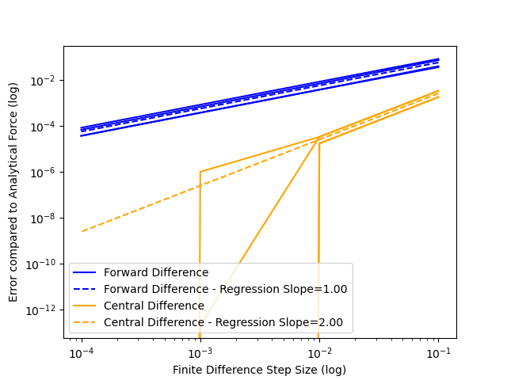
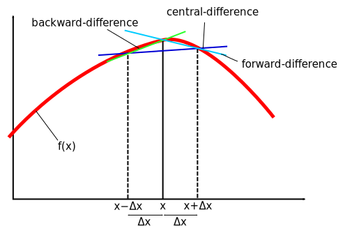

# REPO LINK: [https://github.com/neal-p/CHEM279](https://github.com/neal-p/CHEM279)


# HW1

## Compilation Instructions
  1. Go to the top level repo directory `CHEM279/`
  2. `mkdir -p build`
  3. `cd build`
  4. `cmake ..`
  5. `make hw1_1 hw1_2 hw1_3`

## Run Instructions
Once you have compiled, there will be three executables:
  - `CHEM279/HW1/hw1_1`
  - `CHEM279/HW1/hw1_2`
  - `CHEM279/HW1/hw1_3`

These correspond to each of the three problems. 

### Problem 1
Here, the `hw1_1` executable will read a provided xyz file, print the input to console, if there are any atoms that are not Gold it will crash, otherwise it will calculate and print the energy.
The `sample_input/Energy` folder contains the provided sample input as well as `sample_input/Energy/bad_atoms.txt` and `sample_input/Energy/seven_atoms.txt` to privde additional tests.

You can run these tests by executing `run_samples_problem1.sh`, which will run `./hw1_1 <file> > my_output/Energy/<file>` for each sample and pipe the output to a file in `my_output`.

An example output is shown below:

`./hw1_1 sample_input/Energy/1.txt`

```
Input:
3 atoms
79      0.00000  -4.00000   0.00000
79      0.00000   0.00000   0.00000
79      0.00000   5.00000   0.00000

Energy: -2.01920

```


### Problem 2
Here, the `hw1_2` executable will read a provided xyz file, print the input to console, if there are any atoms that are not Gold it will crash, otherwise it will calculate and print the energy, analytical gradient, and forward/central difference gradients. Because we want to plot the truncation error, this executable also requires a second output file parameter to which the forces will be written for further processing.
The `sample_input/Force` folder contains the provided sample input.

You can run these tests by executing `run_samples_problem2.sh`, which will run `./hw1_2 <file> my_output/Energy/<file.csv> > my_output/Energy/<file>` for each sample and pipe the output to a file in `my_output`.

An example output is shown below:

`./hw1_2 sample_input/Force/1.txt my_output/Force/1.csv`

```
Input:
4 atoms
79      0.00000  -5.00000   0.00000
79      0.00000   0.00000   0.00000
79      0.00000   5.00000   0.00000
79     -4.60000   0.00000   0.00000

Initial Energy: -1.73583
Analytical Gradient: 
-0.04219 -0.89489 -0.04219  0.97927
 0.56398  0.00000 -0.56398  0.00000
 0.00000  0.00000  0.00000  0.00000

Forward Difference Gradient (h=0.10000):
-0.04615 -0.84460 -0.04615  1.04887
 0.60210  0.05965 -0.52940 -0.00668
-0.00561 -0.01999 -0.00561 -0.01064
Central Difference Gradient (h=0.10000):
-0.04221 -0.89817 -0.04221  0.98259
 0.56575 -0.00000 -0.56575  0.00000
-0.00000 -0.00000 -0.00000 -0.00000

Forward Difference Gradient (h=0.01000):
-0.04259 -0.88957 -0.04259  0.98592
 0.56763  0.00595 -0.56037 -0.00067
-0.00056 -0.00200 -0.00056 -0.00106
Central Difference Gradient (h=0.01000):
-0.04219 -0.89492 -0.04219  0.97930
 0.56400  0.00000 -0.56400 -0.00000
-0.00000 -0.00000 -0.00000 -0.00000

Forward Difference Gradient (h=0.00100):
-0.04223 -0.89435 -0.04223  0.97993
 0.56435  0.00060 -0.56362 -0.00007
-0.00006 -0.00020 -0.00006 -0.00011
Central Difference Gradient (h=0.00100):
-0.04219 -0.89489 -0.04219  0.97927
 0.56398  0.00000 -0.56398 -0.00000
-0.00000 -0.00000 -0.00000 -0.00000

Forward Difference Gradient (h=0.00010):
-0.04220 -0.89483 -0.04220  0.97933
 0.56402  0.00006 -0.56395 -0.00001
-0.00001 -0.00002 -0.00001 -0.00001
Central Difference Gradient (h=0.00010):
-0.04219 -0.89489 -0.04219  0.97927
 0.56398 -0.00000 -0.56398 -0.00000
-0.00000 -0.00000 -0.00000 -0.00000

```

#### Errors in Numerical Force
With the data output from `hw1_2` we can investigate the differences between the analytical and numerical gradients. The numerical methods used were finite difference methods, both central and forward difference specifically. For each atom, in each axis I compute the difference between the analytical and finite difference forces at `h=0.1, 0.01, 0.001, 0.0001` (where `h` is the step size).

Plotting the log of each atom's error gradient as a function of log `h` for each of the methods:



As we can see with the forward difference method in blue and central difference in orange, forward difference has larger errors across the board. Central difference has smaller errors, even dropping to `10^-12` by `h=0.001`, which indicates that below a step size of `0.001` it matches the analytical gradient within the precision capable of a `double` in C++.

For the ranges of `h` tested, forward difference is always greater than `10^-5` different from the analytical gradient. 

To Further illustrate the differences, I plot a regression of the average error with dashed lines. As we can see, the slope of the central difference method is larger than that of forward difference again supporting that the error of central difference trends toward a perfect approximation of the analytical gradient faster than forward difference. I found this illustration of the different flavors of finite difference particuarly useful for conceptualizing where the truncation error comes from:



### Problem3
The final executable, `hw1_3`, will take in an xyz file, print the input, crash if there are non-Gold atoms, and then optimize the molecule. For the regular steepest descent, I implemented the standard step size which grows by a factor of `1.2` when a good step is taken and halves when a bad step is taken. But I wanted to use what I thought might be a good step size heuristic for molecule optimization for the steepest descent with line search. The goal of adding line search is to take a nearly perfect step in the direction of the gradient. But, the question becomes, how far out should I start searching? While golden section can tell us withing bounds `a` and `b` where is a minimum, it does have some drawbacks. For example, it assumes there is only one minimum in the range of `a` to `b`. There is a clear boundary at the lower end: `0.0`, ie don't move. But, the upper bound is unknown. Clearly taking a step that moves an atom multiple angstroms is risky in that it is likely to move over multiple minima depending on the surrounding atoms. Therefore, I had the idea of determining the upper bound `b` by the inter-atomic distances. 

Since we have the gradient information at each step of steepest descent, at the beginning of the line search I first find the atom with the largest gradient norm `i`. Then, I find which atom is closest to that atom `j`. Now, to determine the step size, I calculate what `b` would shorten the distance between `i` and `j` by `3/4` if the gradient on atoms `i` and `j` pointed directly at one another.

This ensures that I always move the atom with the largest gradient far enough to reasonably progress the optimization, while not moving too far to potentially have a multi-minima area between `a` and `b`. This works especially well for large inter-atomic distances since they are quickly shrunk down **BONUS attempt***. I also hard code a minimum of 3 steepest descent steps. This ensures that if there is a very, very vanishingly small initial force that I am able to attempt to roll down the very broad hill.


In addition to the provided test cases in `HW1/sample_inputs/SD_with__line_search`, I add `HW1/sample_inputs/SD_with__line_search/very_close.txt`, `HW1/sample_inputs/SD_with__line_search/very_far_apart.txt`, and `HW1/sample_inputs/SD_with__line_search/reasonable.txt` to push the optimizer code.
You can run these tests by executing `run_samples_problem3.sh`, which will run `./hw1_3 <file> > my_output/SD_with_line_search/<file>` for each sample and pipe the output to a file in `my_output`.

Below is a sample output:

`hw1_3 sample_input/SD_with_line_search/1.txt`

```
Input:
2 atoms
79      0.00000   0.00000   0.00000
79      0.00000   0.00000   3.00000

Initial Energy: -5.24317
Initial Gradient:
-0.00000 -0.00000
-0.00000 -0.00000
 1.80352 -1.80352
Optimization Step: 0
Updated Coordiantes:
2 atoms
79      0.00000   0.00000   0.02450
79      0.00000   0.00000   2.97550

Updated Energy: -5.29000
Optimization Step: 1
Updated Coordiantes:
2 atoms
79      0.00000   0.00000   0.02450
79      0.00000   0.00000   2.97550

Updated Energy: -5.29000
Optimization Step: 2
Updated Coordiantes:
2 atoms
79      0.00000   0.00000   0.02450
79      0.00000   0.00000   2.97550

Updated Energy: -5.29000
Optimization finished in 3 steps


Final Energy:-5.29000
Final Gradient: 
-0.00000 -0.00000
-0.00000 -0.00000
-0.00000  0.00000
Final Coordinates:
2 atoms
79      0.00000   0.00000   0.02450
79      0.00000   0.00000   2.97550

Final atom-atom distances:
2.95100
2.95100
```


