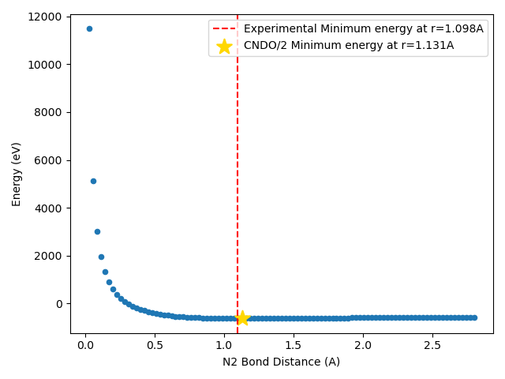

# REPO LINK: [https://github.com/neal-p/CHEM279](https://github.com/neal-p/CHEM279)


# HW4

## Compilation Instructions
  1. Go to the top level repo directory `CHEM279/`
  2. `mkdir -p build`
  3. `cd build`
  4. `cmake ..`
  5. `make hw4 scan`

## Run Instructions
Once you have compiled, there will be two executables:
  - `CHEM279/HW4/hw4`
  - `CHEM279/HW4/scan`


### Main CNDO/2 Program: hw4
This executable takes in an xyz file in the specification of our class and a basis set file in Gaussian format. It calculates and prints the following info as shown in the provided example output including the gamma matrix, initial density matricies of all 0s, and the initial CNDO/2 Fock matrices for alpha and beta electrons. The program then performs the self consistent field algorithm to minimize the energy and solve for the optimal electron densities. An example output of `HF` is shown below:

`./hw4 sample_input/HF.txt basis/basis_set.txt`

```
p=4, q=4

gamma:
21.0778  14.402
 14.402 25.2019

overlap:
        1   0.45346 -0.351578         0         0
  0.45346         1         0         0         0
-0.351578         0         1         0         0
        0         0         0         1         0
        0         0         0         0         1

Hcore:
-118.529  -10.883  8.43788       -0       -0
 -10.883 -210.487       -0       -0       -0
 8.43788       -0 -189.295       -0       -0
      -0       -0       -0 -189.295       -0
      -0       -0       -0       -0 -189.295

----------------
SCF Cycle: 1
Starting Densities: 
0 0 0 0 0
0 0 0 0 0
0 0 0 0 0
0 0 0 0 0
0 0 0 0 0

0 0 0 0 0
0 0 0 0 0
0 0 0 0 0
0 0 0 0 0
0 0 0 0 0


Fock Matrices: 
-118.529  -10.883  8.43788       -0       -0
 -10.883 -210.487       -0       -0       -0
 8.43788       -0 -189.295       -0       -0
      -0       -0       -0 -189.295       -0
      -0       -0       -0       -0 -189.295

-118.529  -10.883  8.43788       -0       -0
 -10.883 -210.487       -0       -0       -0
 8.43788       -0 -189.295       -0       -0
      -0       -0       -0 -189.295       -0
      -0       -0       -0       -0 -189.295


End of SCF Cycle: 1
Change in density: 4

Ca:
  0.119784   0.108018          0          0   0.986906
  0.991784 -0.0579848          0          0   -0.11403
-0.0449083  -0.992457          0          0   0.114076
         0          0          1          0          0
         0          0          0          1          0

Cb:
  0.119784   0.108018          0          0   0.986906
  0.991784 -0.0579848          0          0   -0.11403
-0.0449083  -0.992457          0          0   0.114076
         0          0          1          0          0
         0          0          0          1          0


Ea:
-7.78365
-6.99029
-6.95654
-6.95654
-4.27385

Eb:
-7.78365
-6.99029
-6.95654
-6.95654
-4.27385


Ending Densities:
0.0260161  0.112537 -0.112582         0         0
 0.112537  0.986997  0.013008         0         0
-0.112582  0.013008  0.986987         0         0
        0         0         0         1         0
        0         0         0         0         1

0.0260161  0.112537 -0.112582         0         0
 0.112537  0.986997  0.013008         0         0
-0.112582  0.013008  0.986987         0         0
        0         0         0         1         0
        0         0         0         0         1

----------------
Nuclear Repulsion Energy is 110.742
Electron Energy is -859.473
Total Energy=-748.731
----------------
SCF Cycle: 2
Starting Densities: 
0.0260161  0.112537 -0.112582         0         0
 0.112537  0.986997  0.013008         0         0
-0.112582  0.013008  0.986987         0         0
        0         0         0         1         0
        0         0         0         0         1

0.0260161  0.112537 -0.112582         0         0
 0.112537  0.986997  0.013008         0         0
-0.112582  0.013008  0.986987         0         0
        0         0         0         1         0
        0         0         0         0         1


Fock Matrices: 
 -3.51395  -12.5038   10.0593        -0        -0
 -12.5038  -34.3072 -0.327828        -0        -0
  10.0593 -0.327828   -13.115        -0        -0
       -0        -0        -0  -13.4429        -0
       -0        -0        -0        -0  -13.4429

 -3.51395  -12.5038   10.0593        -0        -0
 -12.5038  -34.3072 -0.327828        -0        -0
  10.0593 -0.327828   -13.115        -0        -0
       -0        -0        -0  -13.4429        -0
       -0        -0        -0        -0  -13.4429


End of SCF Cycle: 2
Change in density: 1.10611

...
...
... 

----------------
SCF Cycle: 17
Starting Densities: 
 0.387878  0.202796 -0.443061         0         0
 0.202796  0.932814  0.146786         0         0
-0.443061  0.146786  0.679308         0         0
        0         0         0         1         0
        0         0         0         0         1

 0.387878  0.202796 -0.443061         0         0
 0.202796  0.932814  0.146786         0         0
-0.443061  0.146786  0.679308         0         0
        0         0         0         1         0
        0         0         0         0         1


Fock Matrices: 
-6.30974 -13.8037  14.8188       -0       -0
-13.8037 -40.7579 -3.69929       -0       -0
 14.8188 -3.69929 -13.1771       -0       -0
      -0       -0       -0 -21.2591       -0
      -0       -0       -0       -0 -21.2591

-6.30974 -13.8037  14.8188       -0       -0
-13.8037 -40.7579 -3.69929       -0       -0
 14.8188 -3.69929 -13.1771       -0       -0
      -0       -0       -0 -21.2591       -0
      -0       -0       -0       -0 -21.2591


End of SCF Cycle: 17
Change in density: 8.09833e-07

Ca:
  0.347792  -0.516642          0          0   0.782382
  0.936128   0.237653          0          0  -0.259203
-0.0520206   0.822558          0          0   0.566297
         0          0          1          0          0
         0          0          0          1          0

Cb:
  0.347792  -0.516642          0          0   0.782382
  0.936128   0.237653          0          0  -0.259203
-0.0520206   0.822558          0          0   0.566297
         0          0          1          0          0
         0          0          0          1          0


Ea:
 -1.67876
-0.865586
 -0.78127
 -0.78127
 0.330361

Eb:
 -1.67876
-0.865586
 -0.78127
 -0.78127
 0.330361


Ending Densities:
 0.387878  0.202796 -0.443061         0         0
 0.202796  0.932814  0.146786         0         0
-0.443061  0.146786  0.679308         0         0
        0         0         0         1         0
        0         0         0         0         1

 0.387878  0.202796 -0.443061         0         0
 0.202796  0.932814  0.146786         0         0
-0.443061  0.146786  0.679308         0         0
        0         0         0         1         0
        0         0         0         0         1

----------------
Nuclear Repulsion Energy is 110.742
Electron Energy is -873.141
Total Energy=-762.399
```

This matches very closely to the given output! The final energies are slightly off, I think this is because I am using Eigen but the sample output is solving with armadillo. Our coefficient matrices and eigenvectors are ever so slightly off from each other. I suspect this is also why my calculation takes a few more cycles to converge. Here is an example of how close the eigenvectors are:


My Output:
```
Ea:
-45.6807
-23.5535 *
-21.2591 *
-21.2591 *
 8.98945 *

Eb:
-45.6807
-23.5535 *
-21.2591 * 
-21.2591 * 
 8.98945 *
 ```

 Given Output:
```
Ea
  -45.6807
  -23.5536 *
  -21.2592 *
  -21.2592 *
    8.9896 *
Eb
  -45.6807
  -23.5536 *
  -21.2592 *
  -21.2592 * 
    8.9896 *
```

Obviously we are only seeing however many significant digits are configured to print. But, the differences in rounding suggest to me there are very small differences between the two solvers that slightly affect the final energies.

To run all the provided tests, a script `run_samples.sh`. This will save all the outputs to `my_output`. 

### N2 Bond scan: ** BONUS **
To experiment with my CNDO/2 code I wanted to try calculating the equilibrium bond distance of N2. I created 100 input geometries scanning from 0 to 3 Angstroms between the two N atoms. I then re-worked the program above to take in multiple xyz files instead of a single file. The output is written to console in csv format. So, I piped it into a file. From there, I plotted the results in python.



The curve matches the *general* expected bond dissociation curve! Although, the minimum energy is not very much lower in energy than the two elements far separated. This can be somewhat expected since CNDO/2 doesnt take into account the more complex pi bonding occuring in N2's triple bond. Nevertheless, despite the well being shallow, the distance itself is remarkably close at 1.131A compared to the experrimental 1.098A. This certainly shows why semi-emperical methods can be really useful for geometry optimization before re-calculating the energies at higher levels of theory!

